# 🌍 BhramanAI

### AI-Powered Multi-Agent Travel Planning Platform

> **Plan smarter. Travel better. Explore more.**

BhramanAI is a full-stack **AI-powered travel planning platform** designed to simplify and personalize the complete travel-planning experience.

Instead of relying on a single AI model to handle every travel-related task, BhramanAI uses a **Multi-Agent AI Architecture powered by LangChain and LangGraph**. Different specialized agents are responsible for destination research, flights, hotels, activities, food, weather, routing, personalization, and itinerary generation.

The platform further uses **Model Context Protocol (MCP)** to connect AI agents with specialized external tools through independently implemented MCP servers.

The result is an intelligent travel assistant capable of taking user preferences and transforming them into a structured, personalized, multi-day travel itinerary.

---

# 📑 Index

- [Introduction](#-introduction)
- [Features and Functions](#-features-and-functions)
  - [1. Authentication](#1--authentication)
  - [2. AI Trip Planning](#2--ai-trip-planning)
  - [3. Conversational Travel Planning](#3--conversational-travel-planning)
  - [4. Multi-Agent AI Architecture](#4--multi-agent-ai-architecture)
  - [5. MCP-Based Tool Integration](#5--mcp-based-tool-integration)
  - [6. AI-Generated Itineraries](#6--ai-generated-itineraries)
  - [7. Travel Recommendations](#7--travel-recommendations)
  - [8. Trip Management](#8--trip-management)
  - [9. Bookings](#9--bookings)
  - [10. User Profile](#10--user-profile)
- [Technology Stack](#️-technology-stack)
- [Implementation Flowchart](#-implementation-flowchart)
- [How BhramanAI Works](#-how-bhramanai-works)
- [Project Structure](#-project-structure)
- [Application Testing Guide](#-application-testing-guide)
- [Installation and Setup](#️-installation--setup)
- [Environment Variables](#-environment-variables)
- [Future Improvements](#-future-improvements)
- [Contributors](#-contributors)
- [Conclusion](#-conclusion)

---

# 🧭 Introduction

Planning a trip often requires switching between several different platforms for finding destinations, flights, hotels, activities, restaurants, weather information, transportation, currency conversion, and itinerary planning.

**BhramanAI** brings these capabilities together into a unified AI-powered travel planning platform.

The application combines:

- **React + Vite** for the frontend
- **Node.js + Express.js** for the backend
- **MongoDB** for data persistence
- **LangChain + LangGraph** for AI orchestration
- **OpenAI GPT-4o / GPT-4o-mini** for AI-powered agents
- **Model Context Protocol (MCP)** for modular tool integration
- **Google OAuth** for authentication
- Specialized MCP servers for travel-related capabilities

The key idea behind BhramanAI is to divide the complex travel-planning problem into smaller specialized tasks and allow multiple AI agents and tools to work together.

---

# ✨ Features and Functions

## 1. 🔐 Authentication

BhramanAI provides authentication functionality to protect user-specific travel information.

### Features

- Google OAuth authentication
- User session management
- Protected application routes
- Authenticated user context
- User-specific trips
- User-specific itineraries
- Profile management

The backend contains dedicated authentication controllers, routes, middleware, and Passport configuration.

The frontend provides dedicated authentication pages including:

- Login
- Signup
- Authentication success
- Protected routes

---

### Sign In

The login page provides users with authentication options and access to the BhramanAI platform.

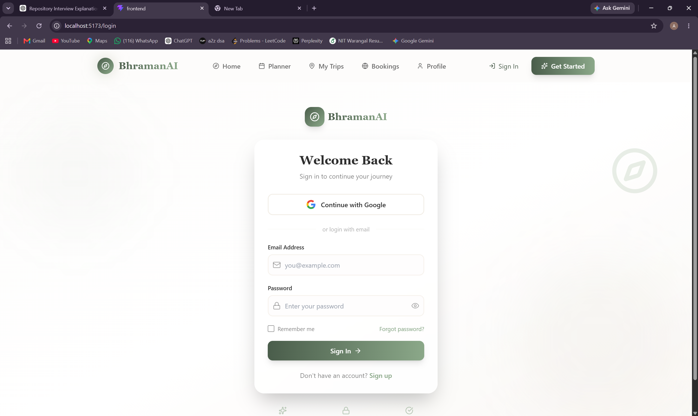

### Authenticated Application

After authentication, users can access the application's travel-planning features.

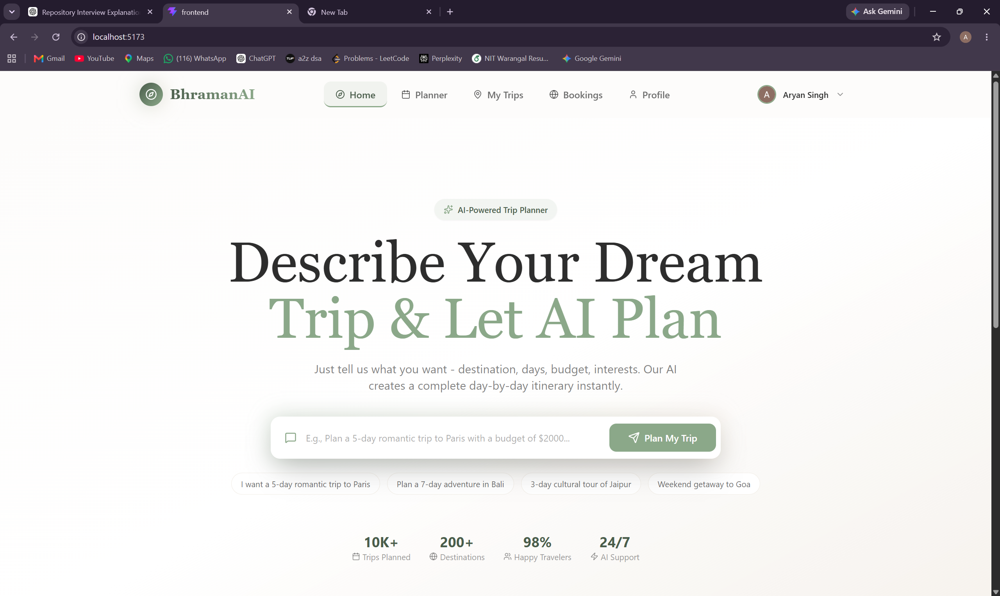


---

## 2. 🗺️ AI Trip Planning

BhramanAI provides an AI-powered trip planning system that allows users to create a complete travel plan based on their preferences.

Users can provide information such as:

- Destination
- Travel dates
- Number of travellers
- Budget
- Interests and preferences

The planning request is processed by the backend and passed through the LangGraph-based travel planning workflow.

The system coordinates multiple specialized agents to research the required travel information and generate a personalized itinerary.

The generated trip is then stored in MongoDB and made available to the user through the application.

---

### Trip Planner

The planner collects the information required to generate a personalized trip.

#### Destination

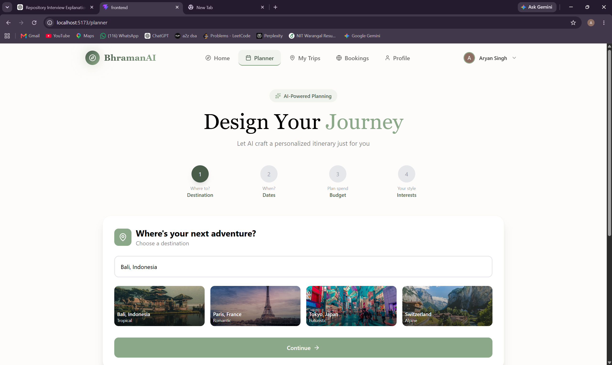

#### Travel Dates

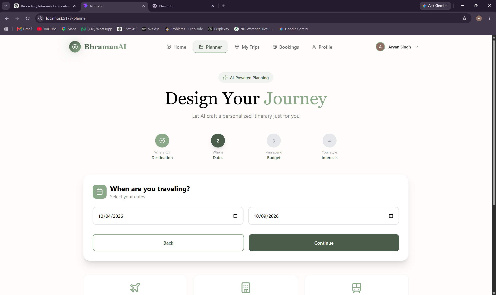

#### Budget and Travellers

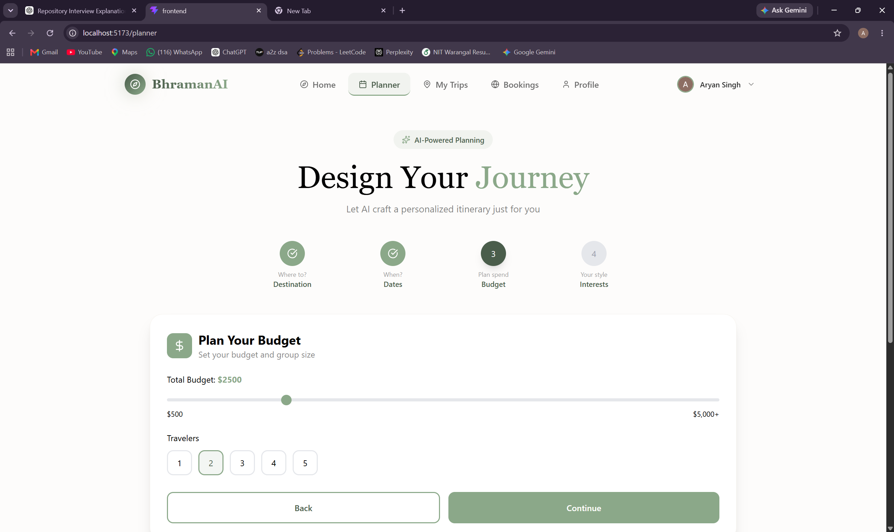

#### Interests

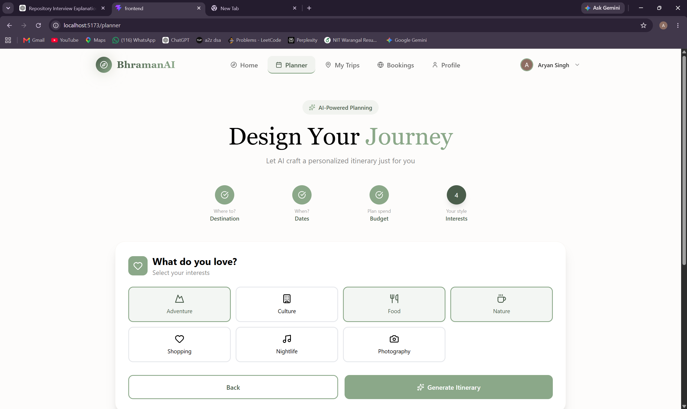

#### Generate Itinerary

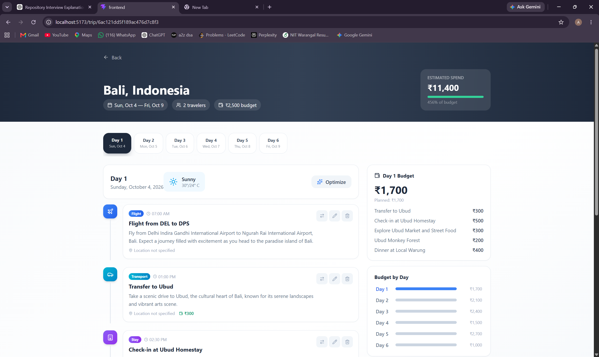


---

## 3. 💬 Conversational Travel Planning

BhramanAI also provides a conversational interface for interacting with the travel-planning system.

Users can communicate with the AI through a chatbot instead of manually entering every requirement.

The conversational system can understand travel-related requests and coordinate the appropriate agents and tools to gather the required information.

The generated itinerary can then be presented directly within the conversation, allowing users to move from planning to viewing their complete trip.

This provides a more natural way of interacting with the travel-planning platform.

---

### AI Travel Chatbot

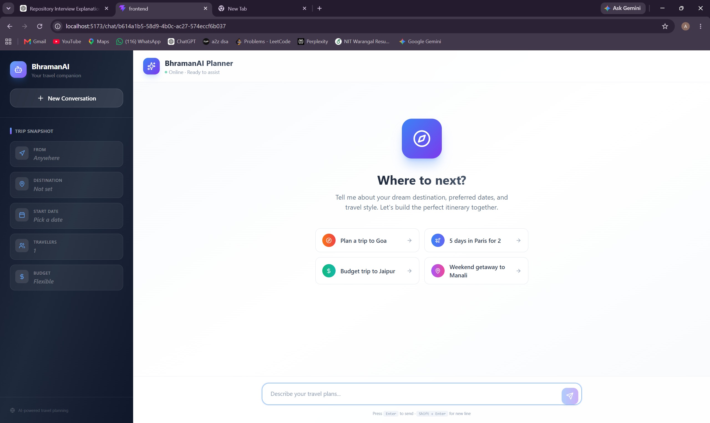

### Trip Generated Through Chat

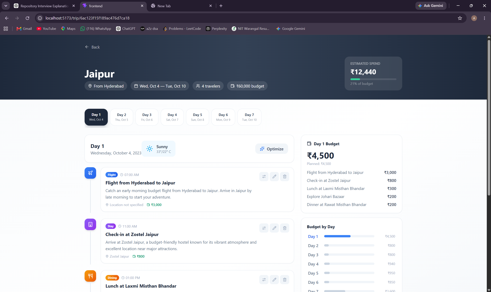


---

## 4. 🤖 Multi-Agent AI Architecture

The core of BhramanAI is its multi-agent architecture built using **LangChain and LangGraph**.

Instead of assigning every task to a single AI agent, the system divides travel planning into multiple specialized responsibilities.

The project contains specialized agents for:

- Destination research
- Flight information
- Hotel information
- Activities
- Food recommendations
- Weather information
- Distance and travel-time information
- Personalization
- Itinerary generation
- Trip planning

Each agent is responsible for a specific part of the overall travel-planning process.

LangGraph is used to coordinate these agents and manage the flow of information between different stages of the planning process.

This approach allows the system to break down a complex travel request into smaller tasks and combine their results into a complete travel plan.

---

## 5. 🔌 MCP-Based Tool Integration

BhramanAI uses the **Model Context Protocol (MCP)** to provide its AI agents with access to specialized travel-related tools.

The project contains six independently implemented MCP servers:

- **Activity MCP** – Provides activity and attraction search capabilities.
- **Currency MCP** – Handles currency conversion.
- **Distance-Time MCP** – Provides routing, distance, travel-time, and timezone-related information.
- **Flights MCP** – Provides flight search functionality.
- **Hotels MCP** – Provides hotel, hotel-detail, availability, and food-related tools.
- **Weather MCP** – Provides weather forecast information.

Together, these MCP servers expose **10 specialized tools** that can be accessed by the travel-planning system.

This modular approach keeps external tool integrations separate from the core AI orchestration logic and allows individual capabilities to be developed and maintained independently.

---

## 6. 🧳 AI-Generated Itineraries

After collecting the required travel information, BhramanAI generates a structured multi-day itinerary.

The itinerary can contain information such as:

- Daily travel activities
- Sightseeing locations
- Recommended activities
- Food and meal suggestions
- Travel information
- Hotels
- Weather-related information
- Estimated trip budget

The itinerary generation process combines information gathered by the specialized agents and produces a structured travel plan that can be viewed through the frontend.

Users can access the generated itinerary through the trip interface and view the plan day by day.

---

### AI Itinerary Generation

The application displays the progress of the AI-powered travel-planning process while the itinerary is being generated.

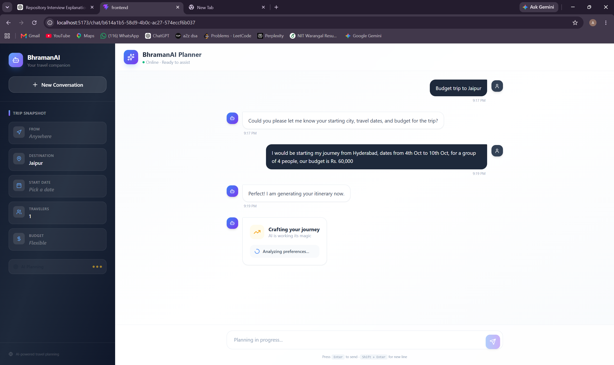

### Generated Itinerary

Once generation is complete, users can view their personalized multi-day itinerary.

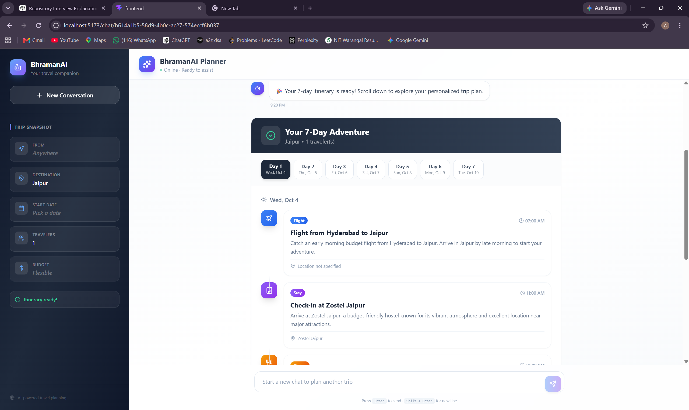

The itinerary provides day-wise travel information including activities, sightseeing, and meal recommendations.


---

## 7. 📍 Travel Recommendations

BhramanAI provides recommendations to help users make decisions during their trip planning.

The recommendation system can provide travel-related options such as:

- Hotels
- Activities
- Attractions
- Food options
- Other destination-related recommendations

The frontend presents these recommendations in a structured interface, allowing users to explore available options and select relevant activities for their trip.

The application also provides an activity-swapping interface, allowing users to modify activities within their generated travel plan.

---

### Recommendations

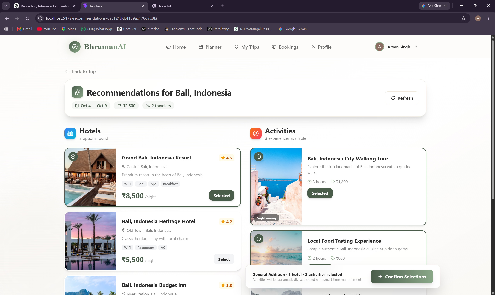


---

## 8. 🗂️ Trip Management

BhramanAI allows authenticated users to manage their generated trips from a dedicated trip interface.

Users can:

- View their generated trips
- Open individual trip details
- View day-wise itineraries
- Review planned activities
- Access saved itinerary information
- Modify selected activities

Trip and itinerary information is persisted in MongoDB, allowing users to access their previously generated travel plans.

---

### My Trips

The My Trips section allows authenticated users to access their previously generated travel plans.

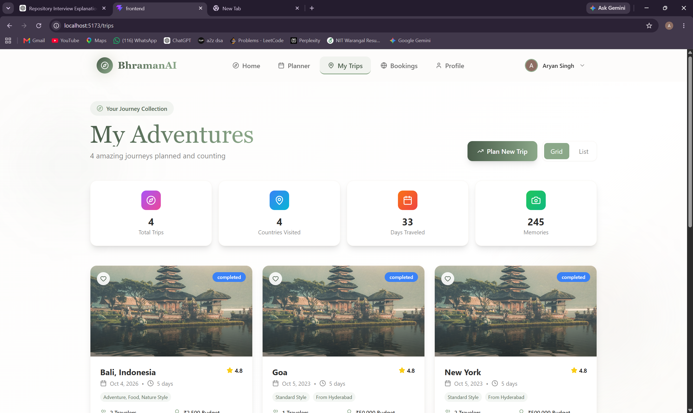

### Detailed Trip View

The detailed trip interface provides a complete view of the generated travel plan, including the itinerary and estimated trip information.

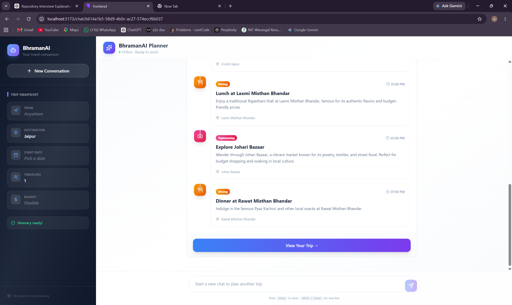


---

## 9. 🎫 Bookings

BhramanAI provides a dedicated bookings section within the application.

The booking interface is designed to organize travel-related booking information for the user and provide a centralized location for accessing booking-related details.

The application separates booking functionality from the trip-planning workflow so that users can manage their travel plans and booking information through dedicated sections of the platform.

---

### My Bookings

The bookings section provides a dedicated interface for managing travel-related booking information.

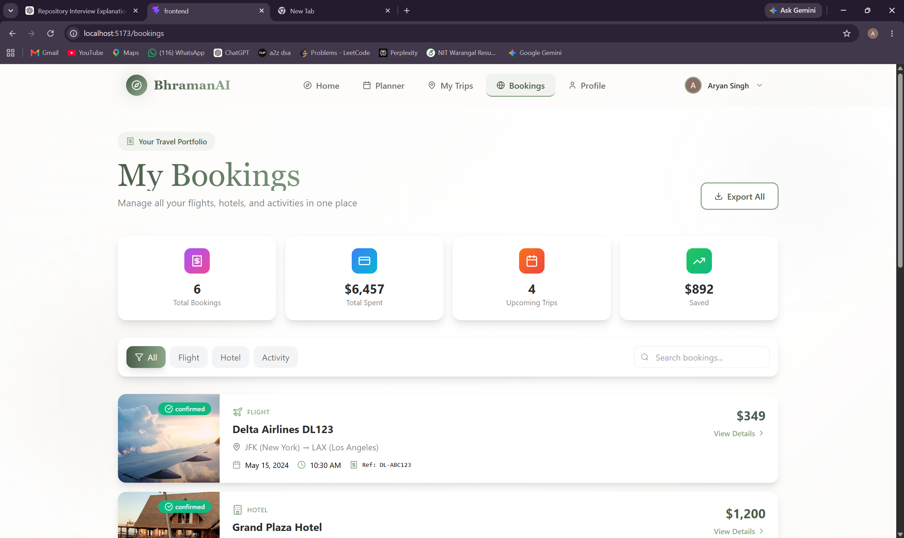


---

## 10. 👤 User Profile

BhramanAI provides a dedicated profile section for authenticated users.

The profile page allows users to access their account-related information and manage their personal application details.

User information is associated with the authenticated account and stored through the backend using MongoDB.

---

### User Profile

Users can access their account-related information through the dedicated profile interface.

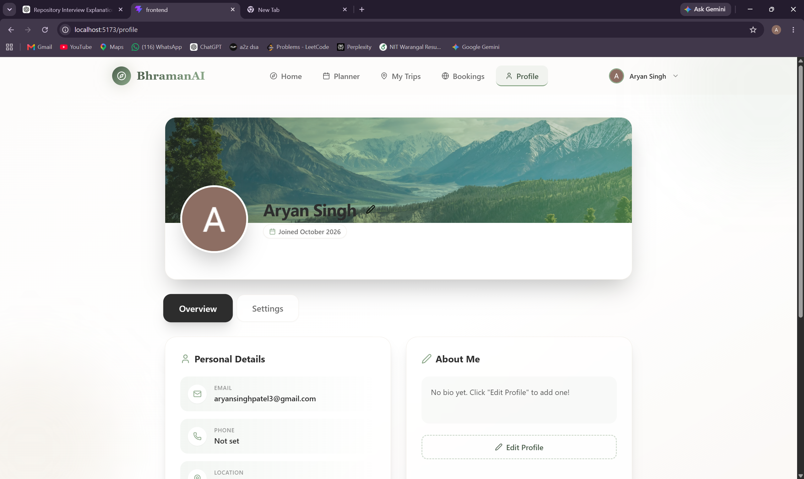


---

# 🛠️ Technology Stack

BhramanAI combines modern web-development technologies with AI orchestration frameworks to build the complete travel-planning platform.

| Technology | Purpose |
|---|---|
| **React.js** | Frontend user interface |
| **Vite** | Frontend development and build tooling |
| **TypeScript** | Type-safe application development |
| **Tailwind CSS** | Frontend styling |
| **Node.js** | Backend runtime |
| **Express.js** | Backend API framework |
| **MongoDB** | Database and data persistence |
| **LangChain** | LLM and tool integration |
| **LangGraph** | Multi-agent workflow orchestration |
| **OpenAI GPT-4o** | Advanced itinerary generation |
| **OpenAI GPT-4o-mini** | Specialized AI agents |
| **Model Context Protocol (MCP)** | Modular AI tool integration |
| **Passport.js** | Authentication |
| **Google OAuth** | User authentication |
| **Zod** | Schema validation |
| **Git & GitHub** | Version control and collaboration |

---

# 🔄 Implementation Flowchart

The following flowchart represents the overall working architecture of BhramanAI, showing how the frontend, backend, multi-agent system, MCP servers, external services, and database work together.

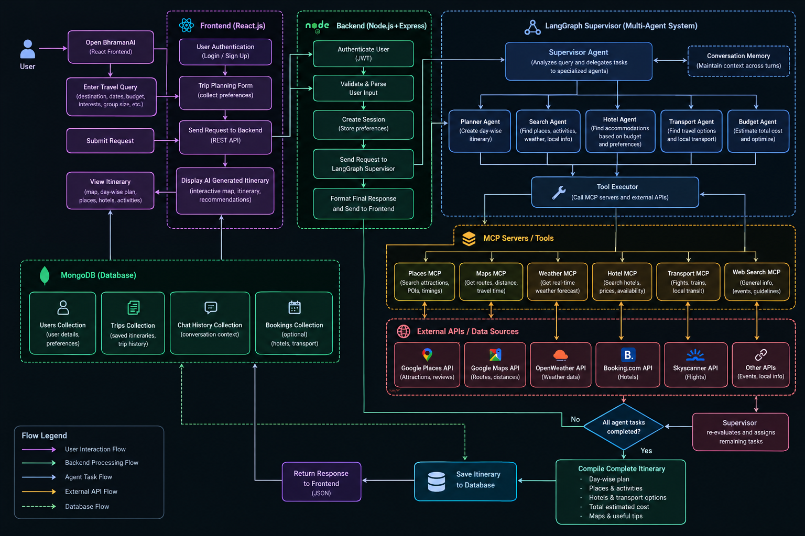

---

# 🔍 How BhramanAI Works

The complete travel-planning process can be understood in a few major stages.

### 1. User Input

The user provides their travel requirements through the React frontend.

This can include the destination, dates, budget, number of travellers, interests, and other travel preferences.

### 2. Backend Processing

The frontend communicates with the Node.js and Express.js backend through API endpoints.

The backend receives the request, validates the required information, and starts the appropriate travel-planning workflow.

### 3. Agent Coordination

LangGraph coordinates the different stages of the travel-planning process.

Specialized agents handle individual responsibilities such as destination research, flights, hotels, activities, food, weather, routing, personalization, and itinerary generation.

### 4. Tool Execution

When an agent requires external travel information, it can use the appropriate MCP-connected tool.

The MCP servers provide specialized capabilities for retrieving travel-related information.

### 5. Information Combination

The results obtained by the different agents are combined by the travel-planning workflow.

The system uses this information to create a coherent travel plan based on the user's requirements.

### 6. Itinerary Generation

The itinerary agent processes the collected information and generates the final structured multi-day itinerary.

### 7. Data Persistence

Generated trip and itinerary information is stored in MongoDB.

This allows authenticated users to access their trips later through the application.

### 8. Frontend Presentation

The completed itinerary is returned to the frontend and presented through the trip and itinerary interfaces.

Users can view their trip day by day and access recommendations and other travel information.

---

# 📁 Project Structure

The project is organized into three major parts: the frontend, backend, and MCP servers.

```text
BhramanAI/
│
├── backend/
│   └── src/
│       ├── api/
│       │   ├── controllers/
│       │   ├── middlewares/
│       │   └── routes/
│       │
│       ├── config/
│       ├── database/
│       │   ├── models/
│       │   └── repositories/
│       │
│       ├── langgraph/
│       │   ├── agents/
│       │   ├── graph/
│       │   ├── nodes/
│       │   ├── state/
│       │   └── tools/
│       │
│       ├── mcp/
│       │   └── client/
│       │
│       └── app.ts
│
├── frontend/
│   └── src/
│       ├── apis/
│       ├── components/
│       ├── pages/
│       ├── types/
│       ├── App.tsx
│       └── main.tsx
│
├── mcp-servers/
│   ├── activity-mcp/
│   ├── currency-mcp/
│   ├── distance-time-mcp/
│   ├── flights-mcp/
│   ├── hotels-mcp/
│   └── weather-mcp/
│
├── package.json
├── package-lock.json
└── README.md
```

---

# 🧪 Application Testing Guide

After setting up the project, users can test BhramanAI through the following workflow.

### Step 1: Open the Application

Open the frontend application in the browser.

```text
http://localhost:5173
```

### Step 2: Sign In

Create an account or sign in using the available authentication options.

Google OAuth can be used to authenticate with the application.

### Step 3: Start Trip Planning

Open the trip planner and provide the required travel details.

Enter information such as:

- Destination
- Travel dates
- Number of travellers
- Budget
- Interests

### Step 4: Generate the Trip

Submit the planning request.

The backend starts the AI-powered travel-planning workflow and coordinates the required agents and tools.

### Step 5: View the Generated Itinerary

Once the planning process is completed, the generated itinerary is displayed in the application.

Users can navigate through the itinerary day by day and view the recommended travel activities.

### Step 6: Explore Recommendations

Users can open the recommendations section to explore available hotels, activities, and other travel options.

### Step 7: Manage Trips

Previously generated trips can be accessed from the **My Trips** section.

---

# ⚙️ Installation & Setup

Follow the steps below to run BhramanAI locally.

## 1. Clone the Repository

```bash
git clone https://github.com/kavyaa1114/BhramanAI.git
cd BhramanAI
```

## 2. Install Root Dependencies

```bash
npm install
```

## 3. Install Backend Dependencies

```bash
cd backend
npm install --legacy-peer-deps
cd ..
```

## 4. Install Frontend Dependencies

```bash
cd frontend
npm install
cd ..
```

## 5. Install MCP Server Dependencies

Each MCP server is maintained independently.

```bash
cd mcp-servers/activity-mcp
npm install
npm run build

cd ../currency-mcp
npm install
npm run build

cd ../distance-time-mcp
npm install
npm run build

cd ../flights-mcp
npm install
npm run build

cd ../hotels-mcp
npm install
npm run build

cd ../weather-mcp
npm install
npm run build

cd ../..
```

## 6. Configure MongoDB

Make sure MongoDB is running locally or provide a valid MongoDB connection string through the backend environment variables.

## 7. Configure Environment Variables

Create the required `.env` files using the environment variables described below.

## 8. Start the Backend

```bash
cd backend
npm run dev
```

## 9. Start the Frontend

Open another terminal:

```bash
cd frontend
npm run dev
```

The frontend will be available at:

```text
http://localhost:5173
```

The backend runs on:

```text
http://localhost:3000
```

---

# 🔑 Environment Variables

The backend requires environment variables for application configuration, authentication, database connectivity, and AI services.

Example backend configuration:

```env
PORT=3000
MONGO_URI=your_mongodb_connection_string
MONGODB_URI=your_mongodb_connection_string
NODE_ENV=development

SESSION_SECRET=your_session_secret

FRONTEND_URL=http://localhost:5173

GOOGLE_CLIENT_ID=your_google_client_id
GOOGLE_CLIENT_SECRET=your_google_client_secret

OPENAI_API_KEY=your_openai_api_key
```

Depending on the MCP server being used, additional API keys may be configured for external travel-data providers.

**Do not commit `.env` files or API keys to the repository.**

---

# 🚀 Future Improvements

BhramanAI can be further extended with additional capabilities to make the travel-planning experience more comprehensive.

Potential improvements include:

- Real-time flight and hotel booking
- More travel-data providers
- Improved activity recommendations
- More detailed budget optimization
- Enhanced personalization based on previous trips
- Real-time travel alerts
- Improved itinerary modification
- Mobile application support
- More advanced destination discovery
- Additional MCP integrations
- Production deployment and scalability improvements

---

# 🏁 Conclusion

BhramanAI demonstrates how modern web technologies, large language models, multi-agent systems, and the Model Context Protocol can be combined to build an intelligent travel-planning platform.

By dividing travel planning into specialized tasks, coordinating multiple AI agents through LangGraph, and connecting those agents to external capabilities through MCP servers, the platform can transform user preferences into structured, personalized travel itineraries.

The project brings together full-stack development, AI engineering, API integration, database management, authentication, and agent orchestration into a single practical application.

---

# 👨‍💻 Contributors

### BhramanAI Development Team

BhramanAI is a collaborative **AI-powered travel planning platform** developed by:

**Aryan Singh**<br>
**Kavya Gupta**

Together, we worked across **AI agent development, LLM orchestration, MCP-based tool integration, backend engineering, frontend development, API integration, and database management** to build the complete application.
